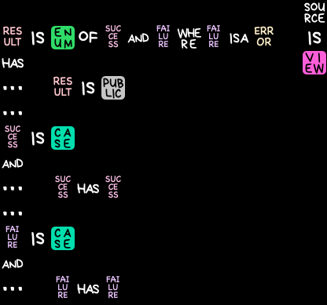

A code visualizer for Swift, which you can read about [on the Swift forums][forums]. Built on [SwiftSyntax][]. Made for April Fools' Day 2019.

Not supported in any way. Licensed under the Apache 2.0 License with Runtime Library Exception as a contribution to the Swift Open Source project. (That is, treat this repo like a pull request to [apple/swift-syntax][SwiftSyntax] or something.)

The font used is [Bryndan Write][], available for free. The (Mac-only) rendering logic is set up to fall back to macOS's "Chalkboard" font if you don't have Bryndan Write installed.

[forums]: https://forums.swift.org/t/new-code-visualizer-for-swift-source-is-view/22454
[SwiftSyntax]: https://github.com/apple/swift-syntax
[Bryndan Write]: https://www.fontspace.com/brynda1231-industries/bryndan-write

## Disclaimer

I wrote "not supported in any way" up there! This was a for-fun project for April Fools'; the code is not intended to be a "best practices" guide or a "how to use SwiftSyntax" tutorial. You can certainly look at it if you want to see how I used SwiftSyntax, but the [SwiftSyntax repo][SwiftSyntax] has many better examples of this. At best it's a "how Jordan hacks things together when he knows he's going to post the code" guide.

I do recommend Kishikawa Katsumi's [Swift AST Explorer][] if you're trying to build a SwiftSyntax-based tool.

[Swift AST Explorer]: https://swift-ast-explorer.kishikawakatsumi.com

## Questions & Answers

### Where did this idea come from?

Quoting from the [forum post][forums], I was "taking cues from [a recent pioneer in experimental predicate logic][hempuli]".

[hempuli]: https://twitter.com/ESAdevlog

### Why are the prerendered cells using PNG instead of PDF?

I was actually going to use PDF! But the app I used to make the prerendered cells didn't handle the blend modes I was using in its PDF export, and I didn't feel like redoing the layers in a more PDF-friendly fashion. PNG is fine.

(PNG also produces smaller files, it turns out, when you're dealing with such a small image and limited palette.)

### Why no Linux support? Swift runs on Linux!

Well, first of all, the library should work fine on Linux to produce a [ragged array][] of Cells. Turning that into a bitmap of some kind (or rendering to an ASCII grid!) is left as an exercise for the reader.

But really I used to make Mac apps, so I knew how to do this with AppKit, and wasn't going to worry about anything else. Remember, for-fun project!

[ragged array]: https://en.wikipedia.org/wiki/Jagged_array

### What didn't you get to implementing?

Hm, insightful question there.

If you check out the prerendered cells (they're inside the playground), you can see an entry for `'S`. I originally wanted to properly qualify members, to be more in keeping with the way the \*cough\* source material works. It'd also produce a cooler-looking pattern beyond the simple [acrostic][].

Because I never got to this, I didn't bother to implement nested types either, although that would be much easier.

The other prerendered cell that I didn't use was `IMPORT`, but that one's not so interesting. It would have just been "APPKIT IS IMPORT" or whatever.

There's a lot more that could be done with the automatic rendering of identifiers: take word boundaries into account, put a closing paren after the ellipsis for inits and subscripts, balance the number of letters on each line, probably more. I also threw in the coloring of non-special identifiers as a last-minute thing, but didn't think about how using Swift's native hashing would result in picking different colors each run.

(On the other hand, the logic to do that coloring—buried in Draw.swift—is more evidence for [HSB being the most useful color format for programmers][HSB].)

All the blank space in the resulting images looks a little bland. I never really planned to do this, but it would be cool™ to have background doodads, like...I dunno, circuitboard patterns. Logic gates. Xcode hammers.

More comments. More doc comments especially. More attention to formatting. More helper functions. Fewer magic numbers. Any sort of efficiency (you'll notice I just concatenate Arrays all the time instead of modifying existing ones, which in theory is something the compiler could optimize but I don't think it does yet).

Tests. If this were a proper project I'd be unit-testing each transformation individually: Syntax -> Model (Parse), Model -> Cell (Render), Cell -> image (Draw). Instead I just punted and now the Tests directory is empty.

Oh, and originally for the forum post I was hoping to have the last image be animated, and some little critter would push a Swift logo block in to replace the "VIEW". Then everything would dissolve back into regular Swift source. Ah well!

[acrostic]: https://en.wikipedia.org/wiki/Acrostic
[HSB]: https://twitter.com/mikolajdobrucki/status/1098130228193476608

### Do you plan to maintain this?

No. "Not supported in any way." I might delete the repository tomorrow.

### Can I send you a pull request?

...I'm tempted, but no. I don't want to deal with licensing.
